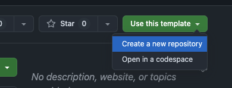
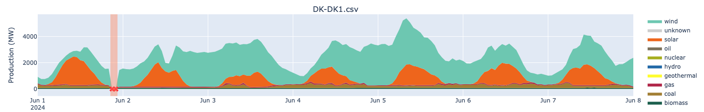
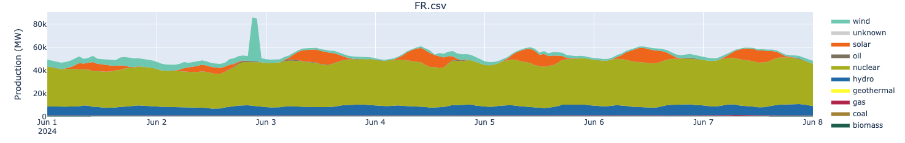
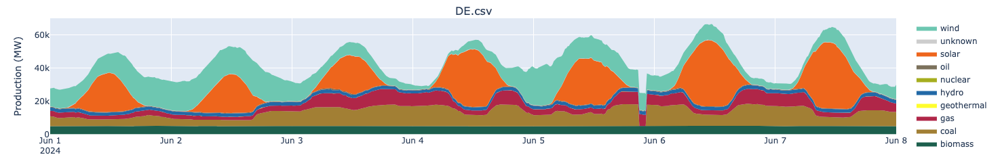

# Data Science - Take home assignment

Welcome to the Electricity Maps Data Science technical challenge!

First off, thanks for taking the time and putting effort into completing this challenge, we really appreciate it!

## Task

At Electricity Maps, we ingest data from 100s of regions around the world. Sometimes data sources report incorrect data, and we need automated ways to detect these errors. You task is to implement data quality checks that are able to catch some of these errors.

The data you will be working with is a timeseries of electricity production breakdowns. Each event represents the electricity produced by different technologies in a region at a given time. We have included data from 3 different regions that each includes a different data quality issue.

## Expectations
- Spend no more than 3 hours on this task. Prioritize wisely and focus on what you think is most important.
- Your approach should be as general as possible. We are maintaining 100s of regions at Electricity Maps, so we can't spend a lot of manual time on each region.
- If you use any static or external data, please include your thoughts on how we could apply this to other regions.
- Please include a description of how you solved the task. Explain your thought process and the decisions you made along the way. Also include any improvements you would make if you had more time.
- You are free to make any changes to the pipeline. If you make changes to the setup and/or dependencies, please include instructions on how to run the pipeline.
- Please reach out if you have any questions or need clarifications.
- Have fun and remember that there is no single correct answer to this task.

## Deliverables
- A `README.md` file that describes how you solved the task. How did you approach the problem? What assumptions did you make?  What improvements would you make if you had more time? Replace this README with your own.
- A short description of how to run the pipeline (if you made any changes to the setup)
- Your implementation of the data quality checks
- (Optional) Your updated `investigation.ipynb`, if you used it to explore the data
- When finished, share the repository with [@FelixDQ](https://github.com/FelixDQ), [@pierresegonne](https://github.com/pierresegonne) and [@wobniarin](https://github.com/wobniarin)

## Task breakdown

### Step 0.1: Get started

Step 1: Create a new repo from this template and make it private.
👇


Step 2: Clone it locally and get the project up and running.

Create a virtual environment and install the dependencies:
```bash
python -m venv .venv
source .venv/bin/activate
pip install -r requirements.txt
```

Step 3: Run the pipeline
```bash
python main.py
```

The included pipeline is a very simple data quality validator that:
1. Reads data from the CSV files
2. Runs a list of data quality checks
3. Outputs plots showing the flagged data points

### Step 0.2 (Optional): Investigate the data

We included an investigation notebook (`investigation.ipynb`) that you can use to explore the data. This notebook is not necessary to complete the task, but it might help you understand the data better.

### Step 1: Implement data quality checks

Implement data quality checks in `src/checks.py` and add them to the list of checks in `src/validate.py`. The checks should be able to catch the data quality issues in the datasets. See the data section for more information on the outliers that needs to be flagged.

You can run the pipeline using `python main.py` and verify that the checks are working as expected.

### Step 2 (Bonus): Improve the pipeline

Currently the pipeline handles all data points individually and doesn't consider the context. When working with timeseries data, it can be beneficial to consider the context of the data points (e.g. how quickly does the generation of a given technology ramp up or down. Is it physically possible?). If you have time, you can try to implement a more advanced pipeline that considers the context of the data points when doing the validation.

## Data
#### DK-DK1
This dataset contains data from West Denmark and includes a few hours of zero production. The data quality check to flag these datapoints have already been implemented and you can use this as a reference for the other datasets.


#### FR
This dataset contains data from France and includes a few hours of abnormaly high wind production. The data quality check to flag these datapoints have not been implemented and you will need to implement this yourself.


#### DE
This dataset contains data from Germany and includes a few hours of incomplete data. Coal production have not been reported for a few hours. The data quality check to flag these datapoints have not been implemented and you will need to implement this yourself.



